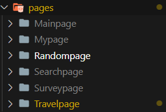
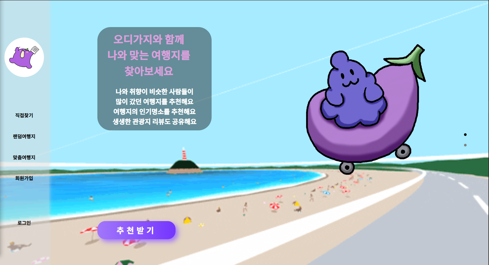
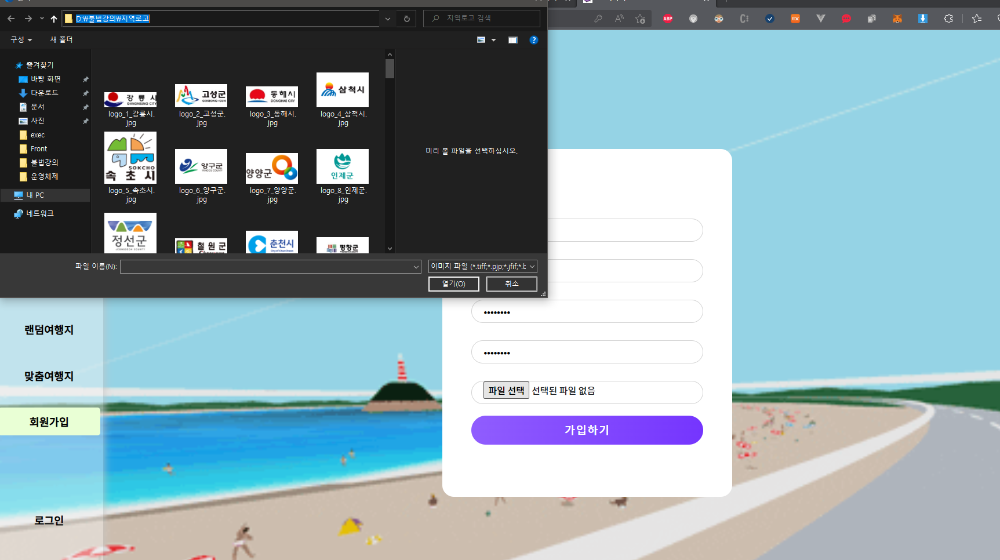

# 오디가지 FRONTEND

## 개요

* 오디가지 서비스를 위한 프론트 서버입니다. 
* `Node`16.0.1v, `React` 17.0.2v 버전으로 개발하였으며 React-BootStrap 5를 사용하였습니다.

## 실행

* `npm install`명령어를 통해 필요한 라이브러리를 설치합니다.(bootstrap, prettier 등등 )
  * Node16.0.1버젼을 권장합니다.
* `npm start`로 실행하면 기본적으로 3000번 포트로 실행이 됩니다. 

## 프로젝트 구조

* API폴더의 Server.js에서 Local과 Server에 배포된 상황에서의 BaseUrl과 페이지들의 경로를 저장합니다.
* index.js 파일의 라우팅 경로를 관리합니다.
* pages 해당 라우팅에 보여줄 .js파일을 모은 폴더입니다.
* components pages의 .js파일들을 컴포넌트화해서 저장해놓는 폴더입니다. 
* 
  * 페이지들은 크게 메인페이지, 마이페이지, 랜덤페이지, 탐색페이지, 설문페이지, 여행지 정보 페이지로 나누어져있습니다.

## 기타

* 카카오맵 API를 프론트에서 직접 불러와서 사용

# 시연시나리오

1. 메인페이지 화면을 확인한다.
   * 
2. `네비게이션바`에서 `회원가입`을 누른다.
   1. 
3. `회원가입`페이지로 이동해서 회원가입을 진행한다.
   1. 
   2. ID, 비밀번호와 닉네임, 프로필 `파일선택`버튼을 통해 프로필 이미지 선택이 가능하다.
   3. 가입하기버튼을 누르면 메인페이지로 돌아온다.
4. `로그인`버튼을 클릭해 가입한 아이디, 비밀번호로 로그인을 진행한다.
   1. 
5. `로그인`이 완료되면 메인페이로 돌아오는데 추천받기 또는 네비에서 `맞춤여행지`를 클릭한다.
   1. 
      * `로그인`이 완료 되었으므로 네비게이션의 `로그인`이 `로그아웃`으로 바뀌었다.
6. `맞춤여행지`를 클릭하면 설문 시작버튼을 눌러 설문을 시작한다.
   1. 
   2. 빈칸을 클릭하면 `dropdown`형식으로 지역들이 나와 클한뒤 추가하기 버튼을 누르면 아래 도시 이름과 별점평가가 나온다.
      1. 
   3. 
   4. `>`버튼을 눌러 다음 페이지로 이동한다.
7. 설문을 진행한다.
   1. .gif)
   2. .gif)
      1. 마지막 설문까지 마치면 추천결과가 나타난다.
      2. 약 3초정도 소요된후 결과가 나타난다.
   3. 결과페이지에서 추천지역의 '도'에 해당하는 지역의 색이 보라색으로 표시된다. 그 지도에 마우스를 올리면 추천 지역의 이미지슬라이드가 나타난다.
      1. .gif)
   4. 이미지를 클릭해 `지역페이지`로 이동하여 지역 게시판과 지역의 평점을 수정할 수 있다.
      1. .gif) 
   5. 추천여행지중 하나를 누르면 여행지 정보와함께 카카오지도를 불러온다.
      1. 
   6. 게시판에 들어가서 댓글을 달고 삭제할 수 있다.
      1. 
   7. 글쓰기로 글을 쓰면 게시판 마지막페이지에서 확인이 가능하다.
      1. 

8. 마이페이지에서 지금까지 방문했던 지역과 쓴 글과 댓글 목록을 확인할 수 있다.
   1. 

9. 직접찾기 페이지에서지도와 `dropdown`을 이용하여 직접 지역정보에 접근이 가능하다. 활성화된 지역은 보라색으로 표시된다.
   1. 

